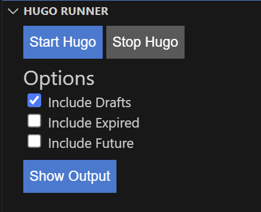
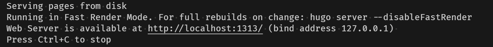

# Hugo Runner (vscode-hugo-runner)

Hugo Runner is a Visual Studio Code extension that allows you to easily run [Hugo](https://gohugo.io) sites from within the editor.

## Features

Hugo Runner adds a new panel (and a few commands to the command palette) to help you run your Hugo site:

Output from Hugo is shown in an output panel, including the server URL for ease of launching the site in your browser (Ctrl+Click to open).

## Getting Started

### Install Hugo

Hugo Runner needs the Hugo executable to be installed on your system.
You can download the binary for your platform from the [Hugo releases page](https://github.com/gohugoio/hugo/releases/latest).

Once downloaded, extract the binary and set the `hugoRunner.hugoPath` setting in your VS Code settings to the path of the binary.

Alternatively, you can run the "Hugo Runner: Install Hugo" command to download and install Hugo for you.

## Commands

### Install Hugo

Downloads and installs the Hugo binary for you.
The latest version is downloaded and stored privately for the runner to use.

### Check Hugo Version

Checks the version of the Hugo binary you have installed.
This command is useful to verify that the Hugo binary is installed correctly and that the path is set correctly in the settings.

## Extension Settings

| Setting                         | Description                                                                                                                                                       |
| ------------------------------- | ----------------------------------------------------------------------------------------------------------------------------------------------------------------- |
| `hugoRunner.hugoExecutablePath` | Path to the Hugo executable. Alternatively, you can omit this and run "Hugo Runner: Install Hugo" to.                                                                   |
| `hugoRunner.siteFolder`         | By default, Hugo Runner will launch hugo for the VS Code workspace folder. To configure a sub-folder for your Hugo site, set this setting (in Workspace Settings) |
| `hugo-runner.port`              | Port to run the Hugo server on. Number, defaults to `1313`                                                                                                        |

<!-- ## Known Issues

Calling out known issues can help limit users opening duplicate issues against your extension. -->

## Release Notes

## v0.3.1 2024-07-09

- Fixed: Runner Stop button disabled even when Hugo is running

## v0.3.0 2024-07-04

- Added: Start Hugo will now prompt to install if Hugo is not found

## v0.2.0 2024-07-03

- Added: WebView options to build drafts, future, and expired content
- Removed: `hugoRunner.showDrafts` setting in favour of the WebView option

## v0.1.2 2024-07-02

- Fix: Version bump to fix docs

## v0.1.1 2024-07-02

- Changed: Added non-Windows support for Install Hugo command

### v0.1.0 2024-07-01

- Command: Install Hugo (Windows only currently)
- Command: Check Version
- Command: Run Hugo Server
- Command: Stop Hugo Server
